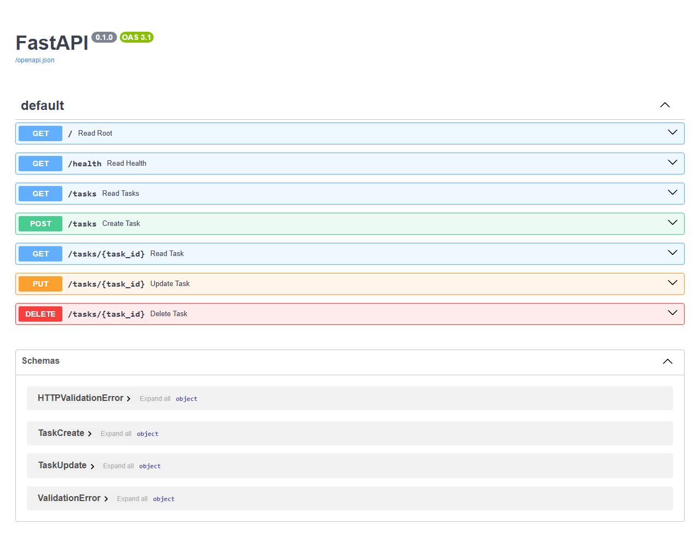

# Task API

A tiny CRUD (Create, Read, Update, Delete) to-do list API built with **Python + FastAPI**.
Data is stored **in memory only** — it resets every time the server restarts (that's intentional for this stage: no database yet).

Interactive docs (Swagger UI) are included for free at [`/docs`](http://localhost:8000/docs).

## Requirements

- Python 3.10+
- pip

## Install & run

```bash
pip install -r requirements.txt
uvicorn task-1.main:app --port 8000
```

Then open:

- API root: http://localhost:8000/
- Swagger UI: http://localhost:8000/docs

> This task lives in the `task-1/` folder of the `flyrank-tasks` repo.

## Endpoints

| Method | Path          | Description                              | Success | Error        |
|--------|---------------|------------------------------------------|---------|--------------|
| GET    | `/`           | API info (name, version, endpoints)      | 200     | —            |
| GET    | `/health`     | Health check ("is the server alive?")    | 200     | —            |
| GET    | `/tasks`      | List all tasks                           | 200     | —            |
| GET    | `/tasks/{id}` | Get one task by id                       | 200     | 404          |
| POST   | `/tasks`      | Create a task (body: `{"title": "..."}`) | 201     | 400 (empty)  |
| PUT    | `/tasks/{id}` | Update title/done of a task              | 200     | 404 / 400    |
| DELETE | `/tasks/{id}` | Delete a task                            | 204     | 404          |

## Example request & response

```bash
curl -i http://localhost:8000/tasks/1
```

```
HTTP/1.1 200 OK
date: Tue, 14 Jul 2026 14:59:21 GMT
server: uvicorn
content-length: 51
content-type: application/json

{"id":1,"title":"Learn what an API is","done":true}
```

Create a task:

```bash
curl -i -X POST http://localhost:8000/tasks \
  -H "Content-Type: application/json" \
  -d '{"title":"Buy milk"}'
```

```
HTTP/1.1 201 Created
content-type: application/json

{"id":4,"title":"Buy milk","done":false}
```

## Swagger UI



Open http://localhost:8000/docs and use the **Try it out** button to exercise the full
CRUD cycle (create → list → update → delete) without writing any `curl` commands.

## Notes

- This API has **no database**: tasks live in a Python list and are lost on restart.
- The server does not trust the client: a missing or empty `title` returns `400`.
- Status codes are meaningful: `200` (ok), `201` (created), `204` (deleted, no content),
  `400` (bad request), `404` (not found).
