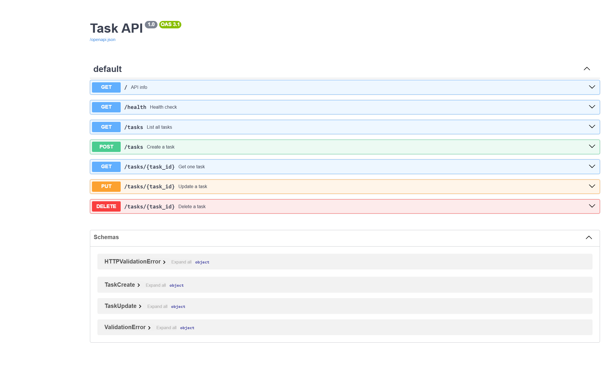

# Task 2 — CRUD Task API

FlyRank Backend Track · Week 2 · Assignment A1

A small REST API that manages a to-do list in memory. Built with **Python** and **FastAPI**.

## Quick start

```bash
cd task-2
pip install -r requirements.txt
uvicorn main:app --port 8000
```

Open [http://localhost:8000/docs](http://localhost:8000/docs) for Swagger UI.

## Endpoints

| Method | Path | Description | Status codes |
|--------|------|-------------|--------------|
| GET | `/` | API info | 200 |
| GET | `/health` | Health check | 200 |
| GET | `/tasks` | List all tasks | 200 |
| GET | `/tasks/{id}` | Get one task | 200, 404 |
| POST | `/tasks` | Create a task | 201, 400 |
| PUT | `/tasks/{id}` | Update title and/or done | 200, 400, 404 |
| DELETE | `/tasks/{id}` | Delete a task | 204, 404 |

## Example request

```bash
curl -i -X POST http://localhost:8000/tasks \
  -H "Content-Type: application/json" \
  -d "{\"title\":\"Buy milk\"}"
```

Example output:

```
HTTP/1.1 201 Created
date: Tue, 14 Jul 2026 14:19:22 GMT
server: uvicorn
content-length: 40
content-type: application/json

{"id":4,"title":"Buy milk","done":false}
```

## Swagger UI

Interactive docs are auto-generated by FastAPI at `/docs`:



## Data note

Tasks live **in memory only**. Restart the server and all tasks reset to the 3 seed examples — that is intentional for this week.
