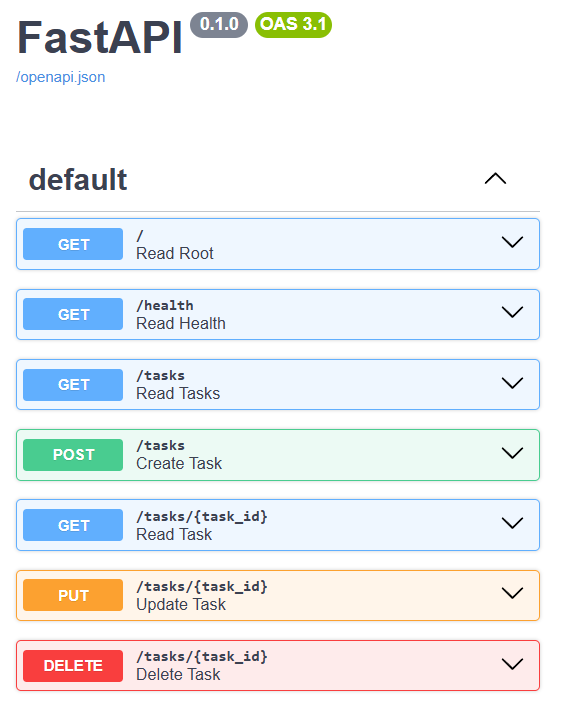

# Task 3 — CRUD Task API, now backed by SQLite

FlyRank Backend Track · Week 3 · Assignment A2

The same CRUD to-do list API from [`task-1/`](../task-1), with its storage swapped from an
in-memory Python list to a real **SQLite** database. Same endpoints, same request/response
shapes, same status codes — the only thing that changed is where the data lives. Restart the
server now and your tasks are still there.

## Why SQLite

- **Single file, zero setup.** No server to install or run — `tasks.db` is just a file on disk,
  created automatically the first time the app starts.
- **Survives restarts.** That's the whole point of this assignment: tasks used to live in a
  Python list and reset every restart; now they live in `tasks.db` and don't.
- **Easy to inspect.** [DB Browser for SQLite](https://sqlitebrowser.org/) opens the file directly
  — no connection string, no credentials.

## Where the database lives

`tasks.db` in this folder, created automatically on first run by [`db.py`](db.py). It is
**git-ignored** (see [`.gitignore`](.gitignore)) so every clone starts fresh: the app creates the
`tasks` table and seeds 3 example tasks the first time it runs, and never reseeds after that
(it only seeds when the table is empty).

## Install & run

```bash
cd task-3
pip install -r requirements.txt
uvicorn main:app --port 8000
```

Then open:

- API root: http://localhost:8000/
- Swagger UI: http://localhost:8000/docs

## Endpoints

Identical to `task-1` — only the storage underneath changed.

| Method | Path          | Description                              | Success | Error        |
|--------|---------------|-------------------------------------------|---------|--------------|
| GET    | `/`           | API info (name, version, storage)         | 200     | —            |
| GET    | `/health`     | Health check                              | 200     | —            |
| GET    | `/tasks`      | List all tasks (`SELECT * FROM tasks`)    | 200     | —            |
| GET    | `/tasks/{id}` | Get one task by id                        | 200     | 404          |
| POST   | `/tasks`      | Create a task (body: `{"title": "..."}`)  | 201     | 400 (empty)  |
| PUT    | `/tasks/{id}` | Update title and/or done                  | 200     | 400 / 404    |
| DELETE | `/tasks/{id}` | Delete a task                             | 204     | 404          |

All writes use **parameterized queries** (`?` placeholders) — the values are passed separately
from the SQL string, never concatenated into it, which is what keeps the database safe from SQL
injection.

## Example request

```bash
curl -i -X POST http://localhost:8000/tasks \
  -H "Content-Type: application/json" \
  -d "{\"title\":\"Buy milk\"}"
```

```
HTTP/1.1 201 Created
content-type: application/json

{"id":4,"title":"Buy milk","done":false}
```

Restart the server (`Ctrl+C`, then `uvicorn main:app --port 8000` again) and `GET /tasks` still
returns that task — it's on disk in `tasks.db`, not in memory.

## Exploring the database by hand

Opened `tasks.db` in **DB Browser for SQLite** and ran a few queries directly against it, with the
API server *not* running:

```sql
SELECT COUNT(*) FROM tasks;
```

Returned `3` — the table has exactly the 3 seeded tasks (checked right after a fresh clone/first
run, before creating any tasks through the API).

Also tried, on the "Execute SQL" tab:

```sql
SELECT * FROM tasks;
SELECT * FROM tasks WHERE done = 1;
UPDATE tasks SET done = 1;
DELETE FROM tasks WHERE done = 1;
```

After running `UPDATE`/`DELETE` in DB Browser and clicking "Write Changes", calling `GET /tasks`
from the running API reflected the change immediately — no restart needed, because the API and DB
Browser both read the same `tasks.db` file. There's no syncing between them; it's one file, one
source of truth.



## Swagger UI

Interactive docs are auto-generated by FastAPI at `/docs`:


## Notes

- The `tasks` table has three columns: `id` (integer primary key, auto-assigned by SQLite),
  `title` (text), `done` (stored as `0`/`1`, converted to a JSON boolean by the API).
- The server still doesn't trust the client: a missing or empty `title` returns `400`.
- Golden rule this stage was built around: only the storage code changed
  ([`db.py`](db.py) + the SQL inside [`main.py`](main.py)'s route handlers) — the routes
  themselves, their status codes, and their JSON shapes are unchanged from `task-1`.
